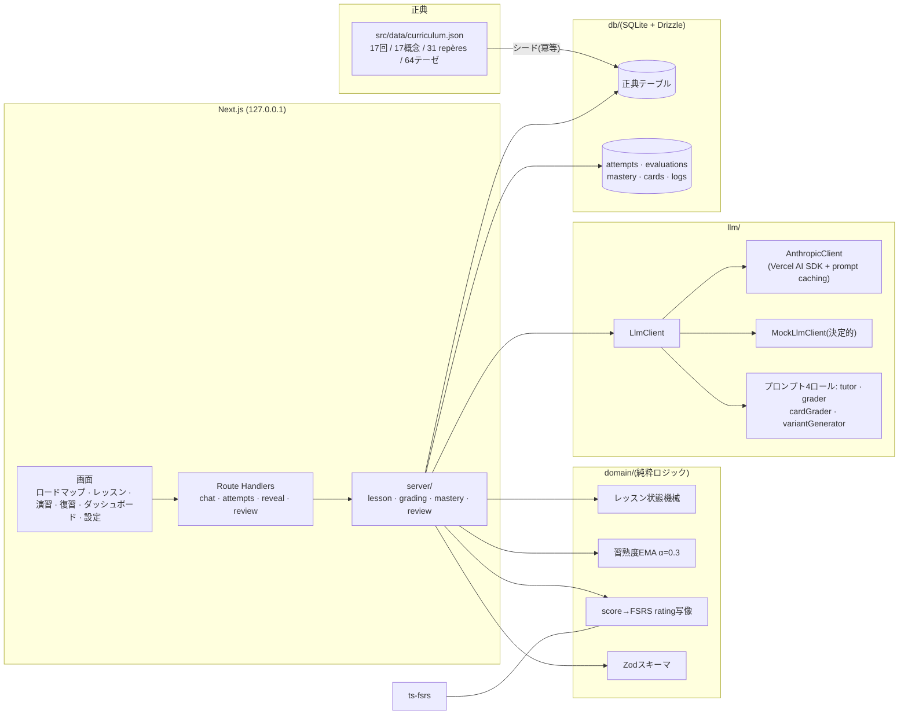

# Le Salon d'Émile — エミールのサロン

[](./.github/workflows/ci.yml)
[](./LICENSE)

**フランス・リセ哲学カリキュラムを対話で学ぶ、ローカル専用のソクラテス式チューター。**
Terminale(最終学年)の全課程 — 17回のセッション、17の概念(notions)、31の
repères、64の正典テーゼ — を、対話レッスンで学び、5観点ルーブリックで採点され、
FSRS間隔反復で定着させます。哲学教育 × 学習科学 × LLM を、すべて手元のマシンで。

[English README](./README.md)

## 名前の由来

名前は設計の二本柱をそのまま要約しています。『エミール』はルソーの消極教育論 —
教師は答えを与えず、発見が起きるように経験を配置する — であり、それはこのアプリの
ガードレールそのものです(試行前に模範解答は出ない。「答えを見る」は記録され、
直後に同型の変形問題が課される)。「サロン」は啓蒙期パリの、講義ではなく会話で
哲学をした部屋であり、それはレッスンエンジンそのものです — あなた自身が何かを
産出したときにだけ先へ進む、ソクラテス式の対話。(Musée d'Orsay → `musee-orsay`
と同じく、スラッグでは d' を落として `salon-emile`。)

## 機能

- **ソクラテス式レッスン** — 全17回。各回は「直観 → 定義とrepères → テーゼ →
  問い → 論述 → 橋渡し」を歩む。チューターLLMはステップ前進を「要求」できるだけで、
  実質的な産出があったかをサーバが判定して初めて進む。
- **ルーブリック採点** — 問題化・概念・論証・教養・表現の5観点を各0〜4で採点。
  根拠の引用と「次の一手」つき。出力は構造化データのみ。
- **演習6形式** — 二直観抽出・repère適用・一文論述・problématique構築・
  プラン設計・ミニ論述。
- **FSRS間隔反復** — repèreカード31枚+テーゼカード64枚+弱い試行から自動生成
  される変形問題(lapse)カード。自由記述の回答を軽量モデルが0〜4で採点し、FSRS
  のratingに写像。失敗した問いは同じ文面では二度と出ず、同型の変形として戻ってくる。
- **習熟度トラッキング** — (概念×観点)ごとのEMAが、5観点レーダー・17×5
  ヒートマップ・ロードマップのソフトゲート(推奨バッジ。ロックはしない)を駆動。
- **消極教育のガードレール** — 試行前の模範解答なし。「答えを見る」は正典素材のみを
  表示し、イベントとして記録され(ダッシュボードに「答えを見た率」)、直後に変形
  問題を1問要求。テーゼ・引用は正典IDが解決するものだけが表示される。
- **ローカル&プライベート** — 127.0.0.1にバインドされたNext.js、ディスク上の
  SQLite、アカウントなし、クラウドなし。決定的なモックLLMだけでアプリ全体と全テスト
  がAPIキーなしで動く。

## スクリーンショット

| ロードマップ | レッスン | 演習 |
| --- | --- | --- |
|  |  |  |

| 復習 | ダッシュボード |
| --- | --- |
|  |  |

`pnpm screenshots` でいつでも再生成できます。

## アーキテクチャ



設計判断は [docs/adr/](./docs/adr)(ADR 7本)と[判断ログ](./docs/decisions.md)に
記録しています。

## クイックスタート

**Node.js ≥ 22** と **pnpm ≥ 10** が必要です。

```bash
git clone https://github.com/yampy/salon-emile.git
cd salon-emile
pnpm install
pnpm db:migrate && pnpm db:seed && pnpm db:verify   # 17/17/31/5/64/10 ✓
pnpm dev                                            # http://127.0.0.1:3000
```

これだけで動きます — 設定なしなら決定的なモックLLMで動作します。実際の対話には
APIキーを設定してください:

```bash
cp .env.example .env    # ANTHROPIC_API_KEY と LLM_PROVIDER=anthropic を設定
```

3つのロール(tutor / grader / light)のモデルは設定画面から選べます。設定画面には
ロール別のトークン使用量も表示されます。

## テスト

すべてモックLLMで動きます — APIキー不要、トークン消費ゼロ:

```bash
pnpm typecheck        # tsc --noEmit
pnpm lint             # eslint
pnpm test             # unit + integration(vitest・一時SQLite)
pnpm test:coverage    # domainのstatementカバレッジ ≥ 90% を強制
pnpm e2e              # Playwright: レッスン通し・論述採点・復習1周
```

## 設計思想

7本のADRが要となる決定を記録しています —
[モジュール境界](./docs/adr/0001-module-boundaries.md)、
[LLM抽象化](./docs/adr/0002-llm-abstraction.md)、
[サーバ判定のレッスン遷移](./docs/adr/0003-lesson-state-machine.md)、
[構造化出力による採点](./docs/adr/0004-grader-structured-output.md)、
[EMA習熟度とソフトゲート](./docs/adr/0005-mastery-ema.md)、
[FSRS一任のスケジューリング](./docs/adr/0006-fsrs-review.md)、
[消極教育ガードレール](./docs/adr/0007-guardrails.md)。

ビジュアルは「紙とインク」— 温白、墨、群青一色、本文セリフ体(Noto Serif JP)。
紙吹雪はありません。

## ライセンス

[MIT](./LICENSE)。

---

*免責: 本アプリはTerminale哲学プログラムの公開情報に着想を得た個人学習ツールで
あり、フランス国民教育省(ministère de l'Éducation nationale)およびいかなる
教育機関とも無関係です。*
