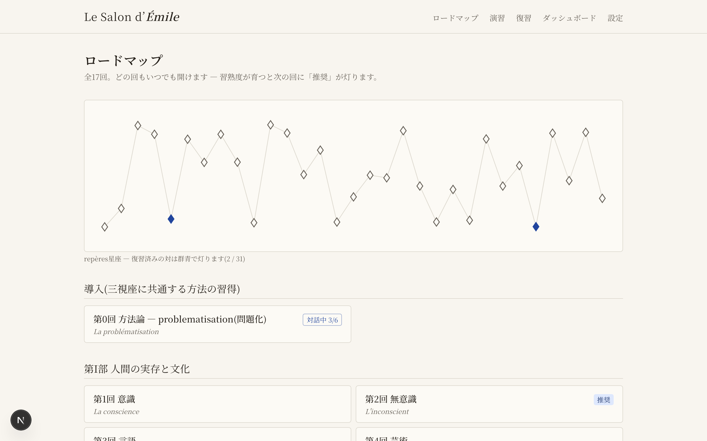
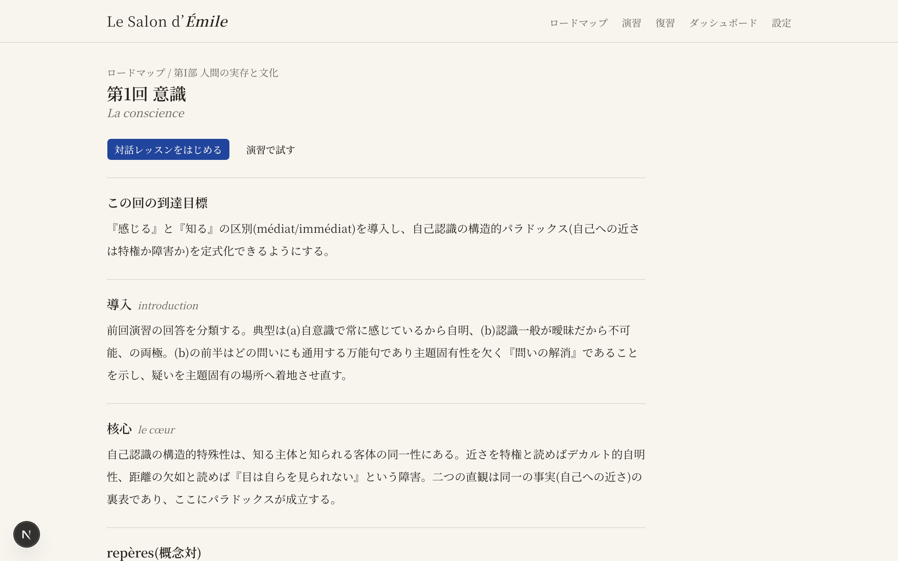
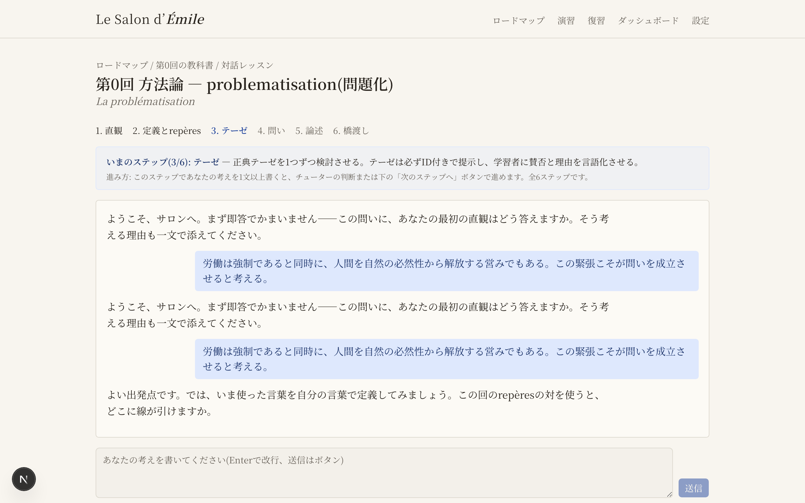
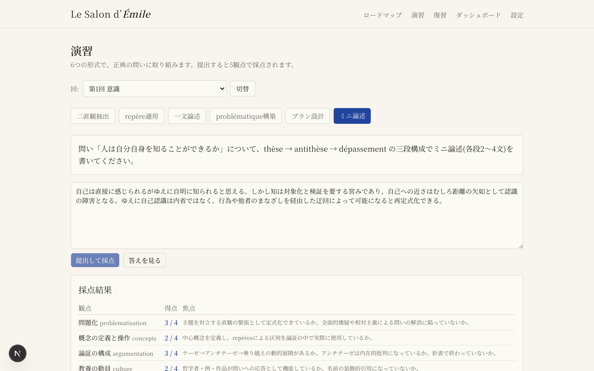
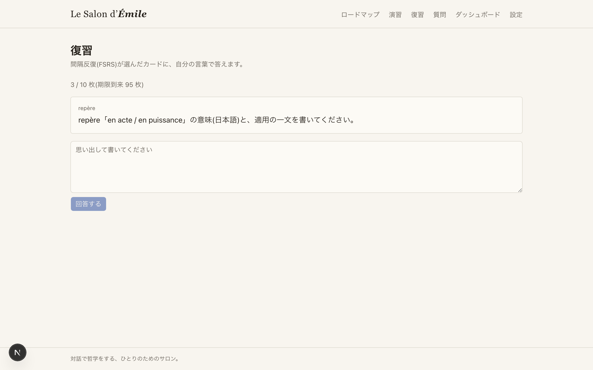
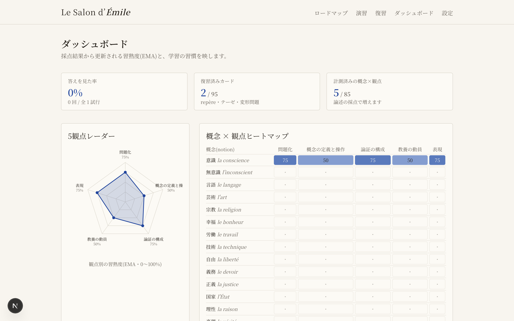
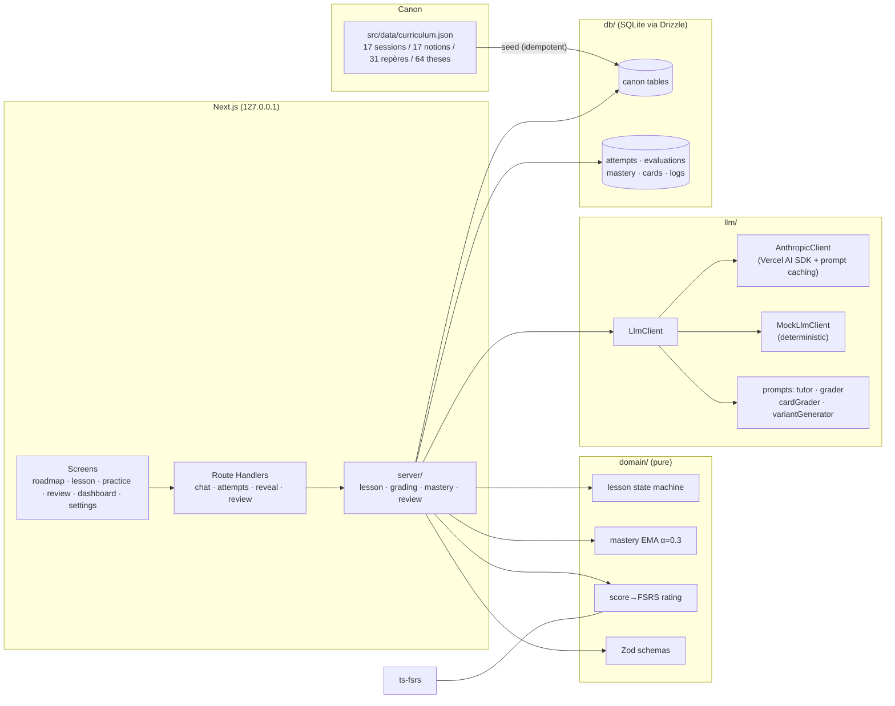

# Le Salon d'Émile

[](./.github/workflows/ci.yml)
[](./LICENSE)

**A local-first Socratic tutor for the French lycée philosophy curriculum** — the full
Terminale program (17 sessions, 17 notions, 31 repères, 64 canonical theses) taught
through dialogue, graded on the official-style five-criterion rubric, and retained
with FSRS spaced repetition. Philosophy education × learning science × LLM, running
entirely on your machine.

[日本語のREADMEはこちら / Japanese README](./README.ja.md)

## Why "Le Salon d'Émile"?

The name compresses the two design pillars. *Émile* is Rousseau's treatise on
negative education: the tutor never hands over answers, but arranges experiences so
that discovery happens — which is exactly what this app's guardrails enforce (no
model answers before your attempt; looking one up is recorded and immediately costs
you an isomorphic practice question). The *salon* is the Enlightenment-era Parisian
room where philosophy was done by conversation rather than lecture — which is
exactly what the lesson engine is: a Socratic dialogue that only moves forward when
*you* have produced something. (Like the Musée d'Orsay → `musee-orsay`, the slug
drops the *d'*: `salon-emile`.)

## Features

- **Textbook first** — every session is also a reading: goal, introduction, core
  argument, repères, canonical theses and questions laid out as a study text, with
  cached AI model answers in the three-part dissertation form.
- **Socratic lessons** — 17 sessions, each walking `intuition → definition/repères →
  theses → question → essay → bridge`. The tutor requests step advances — and the
  learner can advance too — but the server grants them only after substantive
  learner output.
- **Rubric grading** — essays and exercises scored 0–4 on problematisation,
  concepts, argumentation, culture, expression, with evidence quotes and concrete
  next moves. Structured output only.
- **Six exercise formats** — twin-intuition extraction, repère application,
  one-sentence thesis, problématique construction, plan design, mini-essay.
- **FSRS spaced repetition** — 31 repère cards, 64 thesis cards, plus lapse cards
  auto-generated from weak attempts; free-text answers graded by a light model and
  mapped onto FSRS ratings. Failed questions return as fresh isomorphic variants,
  never verbatim.
- **Mastery tracking** — an EMA per (notion × criterion) feeds a five-axis radar, a
  17×5 heatmap, and a *soft* roadmap gate (recommendations, never locks).
- **Negative-education guardrails** — no model answers before your attempt;
  "reveal" shows canon material only, is logged (the dashboard shows your reveal
  rate) and forces a variant question; theses/quotes render only if their canon ID
  resolves.
- **Local & private** — Next.js bound to 127.0.0.1, SQLite on disk, no accounts, no
  cloud. A deterministic mock LLM runs the whole app (and all tests) without an API
  key.

## Screenshots

| Roadmap | Textbook | Lesson |
| --- | --- | --- |
|  |  |  |

| Practice | Review | Dashboard |
| --- | --- | --- |
|  |  |  |

Regenerate anytime with `pnpm screenshots`.

## Architecture



Design rationale lives in [docs/adr/](./docs/adr) (seven decision records) and the
running [decision log](./docs/decisions.md).

## Quickstart

Requires **Node.js ≥ 22** and **pnpm ≥ 10**.

```bash
git clone https://github.com/yampy/salon-emile.git
cd salon-emile
pnpm install
pnpm db:migrate && pnpm db:seed && pnpm db:verify   # 17/17/31/5/64/10 ✓
pnpm dev                                            # http://127.0.0.1:3000
```

That's it — with no configuration the app runs on the deterministic mock LLM. For
real dialogue, pick one:

```bash
# Option A — your Claude Pro/Max subscription (via Claude Code's login):
#   requires Claude Code installed and logged in on this machine
echo "LLM_PROVIDER=claude-code" > .env

# Option B — Anthropic API with OAuth (billed as API usage):
brew install anthropics/tap/ant && ant auth login

# Option C — Anthropic API with a classic key:
cp .env.example .env    # set ANTHROPIC_API_KEY, LLM_PROVIDER=anthropic
```

Models for the three roles (tutor / grader / light) are chosen on the settings
screen, which also tracks token usage per role.

## Tests

Everything runs on the mock LLM — no API key, no tokens:

```bash
pnpm typecheck        # tsc --noEmit
pnpm lint             # eslint
pnpm test             # unit + integration (vitest, temp SQLite)
pnpm test:coverage    # domain statement coverage ≥ 90% enforced
pnpm e2e              # Playwright: lesson walkthrough, essay grading, review round
```

## Design philosophy

Seven ADRs document the load-bearing decisions —
[module boundaries](./docs/adr/0001-module-boundaries.md),
[the LLM abstraction](./docs/adr/0002-llm-abstraction.md),
[server-judged lesson transitions](./docs/adr/0003-lesson-state-machine.md),
[structured-output grading](./docs/adr/0004-grader-structured-output.md),
[mastery as EMA with a soft gate](./docs/adr/0005-mastery-ema.md),
[FSRS-only scheduling](./docs/adr/0006-fsrs-review.md), and
[the negative-education guardrails](./docs/adr/0007-guardrails.md).

The visual language is "paper and ink": warm white, sumi ink, a single ultramarine
accent, serif body text (Noto Serif JP) — and deliberately no confetti.

## License

[MIT](./LICENSE).

---

*Disclaimer: this is a personal study tool inspired by the public Terminale
philosophy program. It is not affiliated with, endorsed by, or connected to the
French Ministry of National Education (ministère de l'Éducation nationale) or any
educational institution.*
